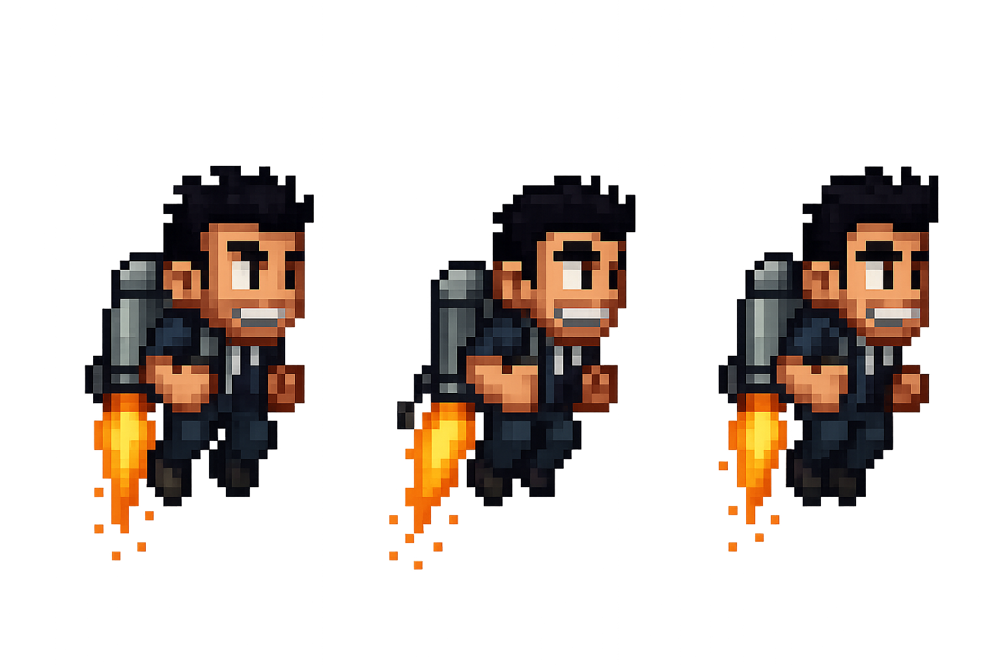

# 🚀 Jetpack Game

Um jogo 2D estilo *Jetpack Joyride*, desenvolvido com [Flutter](https://flutter.dev/) + [Flame Engine](https://flame-engine.org/). Neste jogo, você controla um personagem que voa com um jetpack, coleta moedas, desvia de mísseis e enfrenta um chefão que lança cadeiras!

---

## 📸 Imagens do Jogo

> 
> 
> 
>
> 

---

## 📦 Pré-requisitos

Antes de tudo, instale:

- [Flutter SDK](https://docs.flutter.dev/get-started/install) (versão recomendada: `3.16.0` ou superior)
- [Android Studio](https://developer.android.com/studio) com emulador ou dispositivo real
- Extensão Flutter no VSCode (opcional)
- Git instalado

---

## 📚 Observações

> Este jogo foi desenvolvido como parte da disciplina de **Engenharia de Software** durante o curso de aplicações móveis.  
> O foco principal do projeto é aplicar conceitos de programação, arquitetura de software e uso de bibliotecas modernas como o Flutter e o Flame Engine.
